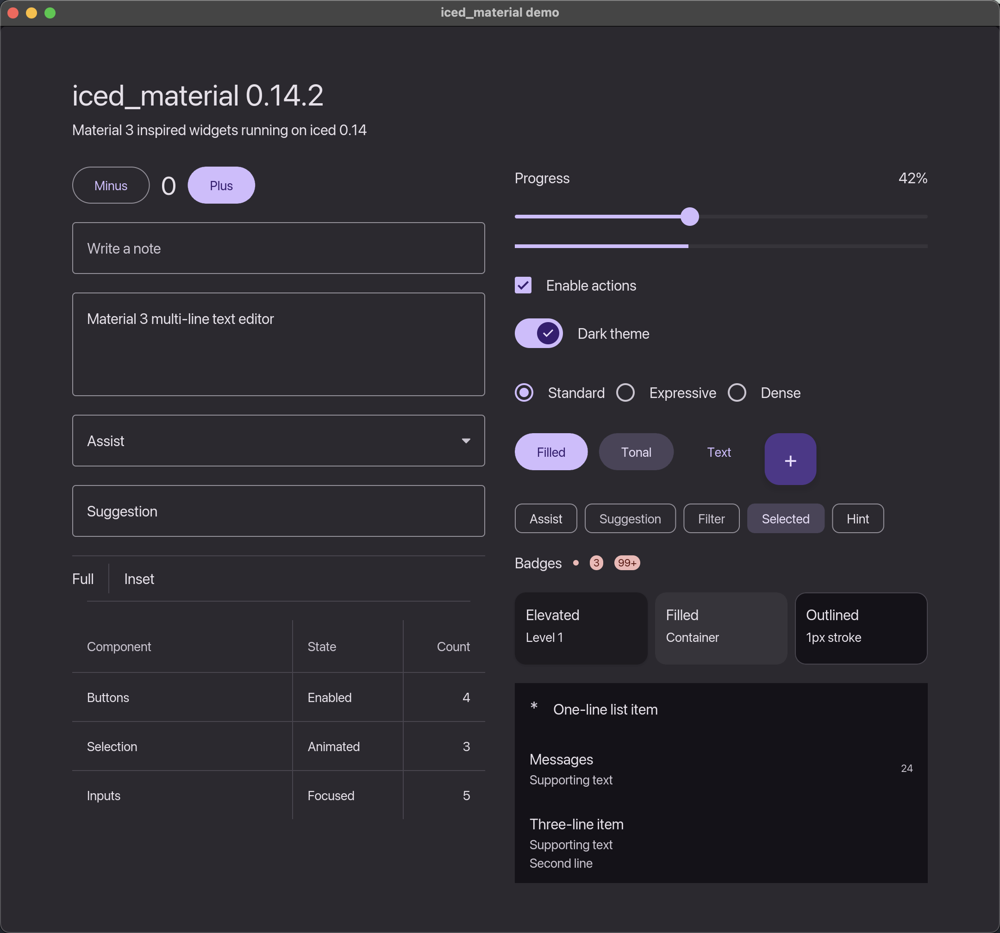

# iced_material

Material 3 inspired widgets and theme defaults for
[`iced`](https://iced.rs) 0.14.



## Quick Start

```toml
[dependencies]
iced = "0.14"
iced_material = "0.14.2"
```

```rust
use iced_material as material;

fn view<'a, Message>() -> iced::Element<'a, Message, material::Theme> {
    material::widget::button::filled("Button").into()
}
```

## Components

The crate provides Material-sized constructors and token-backed styles for:

- Buttons, floating action buttons, icon buttons, and chips
- Text input, text editor, select, and searchable combo box
- Checkbox, switch, radio, slider, and progress indicator
- Dividers, tooltips, badges, lists, cards, and data tables
- Material color schemes, typography tokens, shape tokens, elevation, and motion constants

## Features

- `default`: Enables SVG support.
- `serde`: Adds `serde` support for theme data.
- `animate`: Enables integration with `iced_anim`.
- `crisp`: Enables pixel snapping for crisp edges.
- `dialog`: Enables `iced_dialog` support.
- `selection`: Enables `iced_selection` support.
- `markdown`: Enables the markdown widget.
- `svg`: Enables the SVG widget.
- `qr_code`: Enables the QR code widget.

## Development

This repository includes a Nix flake for a reproducible local development
environment.

```sh
nix develop
cargo test --all-features
cargo check --examples
```

The full widget showcase lives in `examples/example.rs`.

## License

MIT
